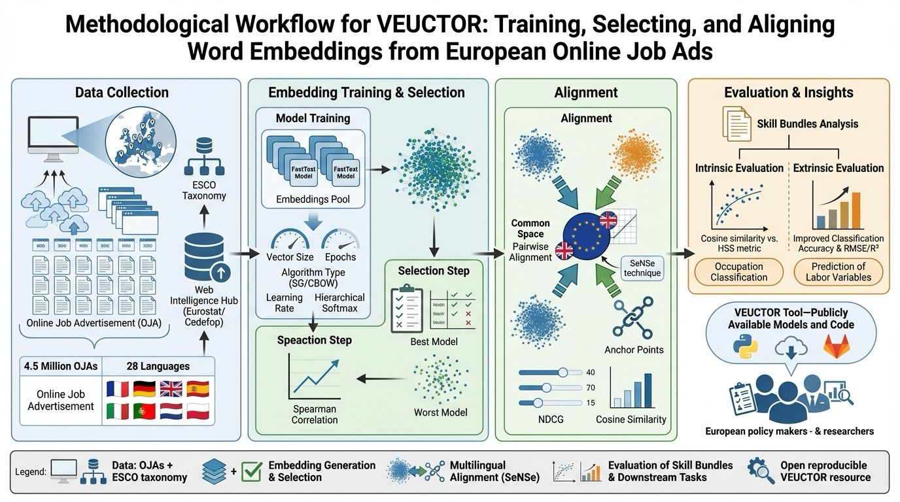

# VEUCTOR

## Training, Selecting, and Aligning Word Embeddings from European Online Job Advertisements

------------------------------------------------------------------------

## 🚀 What is VEUCTOR?

VEUCTOR is a **reproducible methodological framework** for training,
selecting, and aligning word embedding models built from European Online
Job Advertisements (OJAs).

Unlike standard embedding repositories, VEUCTOR does not treat word
embeddings as neutral preprocessing tools.\
It demonstrates that **embedding choice is a methodological decision**
with measurable empirical consequences for:

-   Occupational similarity structures
-   Skill bundle composition
-   Classification performance
-   Wage and education prediction
-   Cross-country semantic comparability

**Credits**

VEUCTOR is partially supported within the research activity of a grant entitled "PILLARS - Pathways to Inclusive Labour Markets" under the call H-2020 TRANSFORMATIONS 18-2020 "Technological transformations, skills, and globalization - future challenges for shared prosperity", grant agreement number 101004703 - PILLARS. See https://www.h2020-pillars.eu/

------------------------------------------------------------------------

# 🖼 Methodological Workflow

The entire framework is summarized in the following diagram:



*Figure 1 -- End‑to‑end VEUCTOR pipeline: from OJA data collection to
embedding generation, selection via HSS, multilingual alignment with
SeNSe, and downstream validation.*

The workflow is structured into four main phases:

1.  **Data Collection & Pre‑processing**
2.  **Embedding Training & Selection**
3.  **Multilingual Alignment**
4.  **Intrinsic & Extrinsic Evaluation**

------------------------------------------------------------------------

# 📊 Data Sources

## Online Job Advertisements (OJAs)

The corpus comes from the **Web Intelligence Hub (WIH)** initiative
developed by **Eurostat** and **Cedefop** under the Trusted Smart
Statistics framework.

-   WIH‑OJA‑NLPv1 representative sample\
-   Release: r20221217\
-   4,610,821 job advertisements\
-   28 European countries\
-   Stratified by occupation (ISCO‑08), contract type, salary,
    education, working time, economic activity and experience

The WIH dataset is described in detail in the VEUCTOR paper (Section 4,
Experimental Results).

## ESCO Taxonomy

Evaluation is grounded in:

**ESCO -- European Skills, Competences, Qualifications and
Occupations**\
https://esco.ec.europa.eu/

ESCO provides:

-   Multilingual occupation hierarchy\
-   Skill--occupation relationships\
-   ISCO alignment

ESCO is used as a **semantic benchmark**, not as a normative ground
truth.

------------------------------------------------------------------------

# 🧠 Methodology

## 1️⃣ Embedding Pool Generation

For each country, FastText models (Bojanowski et al., 2017) are trained
on preprocessed OJA corpora.

Grid search over:

-   Vector size ∈ {50, 100, 300}\
-   Epochs ∈ {10, 50, 100}\
-   Algorithm ∈ {SkipGram, CBOW}\
-   Hierarchical Softmax ∈ {0,1}\
-   Learning rate ∈ {0.01, 0.05, 0.1}

➡ **108 models per country**

Preprocessing includes:

-   HTML stripping\
-   Token normalization\
-   Language-specific stopword removal\
-   N-gram detection (Gensim Phrases)

------------------------------------------------------------------------

## 2️⃣ Intrinsic Evaluation -- Hierarchical Semantic Similarity (HSS)

Embedding quality is assessed using **Hierarchical Semantic Similarity
(HSS)**\
(Giabelli et al., 2020).

HSS is based on:

-   Information Content (Resnik, 1999)\
-   Lowest Common Ancestor computation\
-   Taxonomic probability estimation

For each occupation pair:

1.  Compute cosine similarity between vectors\
2.  Compute HSS score\
3.  Compute Spearman rank correlation (ρ)

The best model maximizes:

ρ(cosine similarity, HSS)

This ensures that the embedding geometry respects the ESCO hierarchy.

------------------------------------------------------------------------

## 3️⃣ Multilingual Alignment -- SeNSe

Country-specific embeddings are independently trained and therefore not
directly comparable.

We apply **SeNSe Alignment** (Malandri et al., 2024):

-   Hyperparameter standardization\
-   Anchor selection via NDCG thresholds\
-   Orthogonal Procrustes transformation\
-   Pairwise alignment to UK reference space

Alignment quality is evaluated via:

**Cross‑Lingual Semantic Fitting Score (CLS)**

This step ensures cross-country semantic comparability.

------------------------------------------------------------------------

## 4️⃣ Extrinsic Evaluation

We validate embedding impact on:

-   4-digit ESCO occupation classification\
-   Wage prediction\
-   Education prediction\
-   Experience modeling\
-   Contract-type classification

Metrics:

-   Accuracy\
-   RMSE\
-   R²

Best-performing embeddings consistently outperform worst-performing
configurations, confirming that embedding selection materially affects
empirical outcomes.

------------------------------------------------------------------------

# 📂 Repository Structure

    veuctor/
    │
    ├── data/
    │   ├── esco/
    │   └── supplementary/
    │
    ├── models/
    │   ├── fasttext/
    │   └── aligned/
    │
    ├── HSS_eval.py
    ├── alignment_eval.py
    ├── demo.py
    ├── requirements.txt
    └── README.md

------------------------------------------------------------------------

# ⚙ Installation

``` bash
git clone https://gitlab.com/crisp1/veuctor.git
cd veuctor

python -m venv .venv
source .venv/bin/activate
pip install -r requirements.txt
```

Python ≥ 3.12

------------------------------------------------------------------------

# 📚 References

-   Bojanowski, P., Grave, E., Joulin, A., & Mikolov, T. (2017).\
    *Enriching Word Vectors with Subword Information.*\
    https://arxiv.org/abs/1607.04606

-   Giabelli, A., Malandri, L., Mercorio, F., Mezzanzanica, M., &
    Seveso, A. (2020).\
    *NEO: A Tool for Taxonomy Enrichment with New Emerging
    Occupations.*\
    https://doi.org/10.1016/j.eswa.2020.113325

-   Malandri, L., Mercorio, F., Mezzanzanica, M., & Pallucchini, A.
    (2024).\
    *SeNSe: Semantic Network Space Alignment Framework.*

-   Resnik, P. (1999).\
    *Semantic Similarity in a Taxonomy: An Information-Based Measure.*\
    https://aclanthology.org/J95-1003/

-   European Commission.\
    *ESCO -- European Skills, Competences, Qualifications and
    Occupations.*\
    https://esco.ec.europa.eu/

------------------------------------------------------------------------

# 🔎 Key Message

> Embedding selection is not neutral.

VEUCTOR provides a fully reproducible, taxonomy‑driven framework for
building robust multilingual labor market intelligence systems grounded
in European statistical infrastructure.

#  Citations
If you use **VEUCTOR** in your research, please cite:

**Emilio Colombo and Simone D’Amico and Fabio Mercorio and Mario Mezzanzanica**  
*Training, Selecting, and Aligning Word Embeddings from European Online Job Advertisements.*  
*Information Sciences* **2026**, *Volume 741*
🔗 https://www.sciencedirect.com/science/article/pii/S0020025526002057

### BibTeX
```bibtex
@article{COLOMBO2026123274,
title = {VEUCTOR: Training and selecting best vector space models from online job ads for European countries},
journal = {Information Sciences},
volume = {741},
pages = {123274},
year = {2026},
issn = {0020-0255},
doi = {https://doi.org/10.1016/j.ins.2026.123274},
url = {https://www.sciencedirect.com/science/article/pii/S0020025526002057},
author = {Emilio Colombo and Simone D’Amico and Fabio Mercorio and Mario Mezzanzanica},
keywords = {Word embedding, Machine learning, Labor market, NLP}
}
