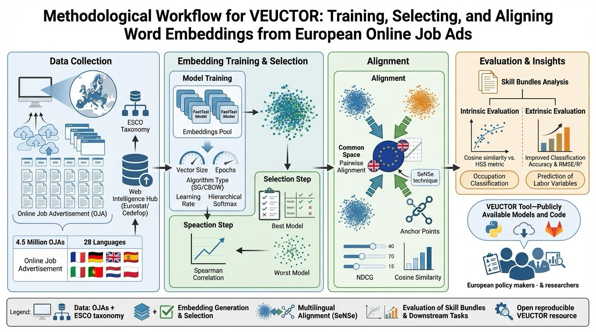

# VEUCTOR

**Training, Selecting, and Aligning Word Embeddings from European Online Job Advertisements**

---

> *Embedding selection is not neutral.*
> VEUCTOR provides a fully reproducible, taxonomy-driven framework for building robust multilingual labor market intelligence systems grounded in European statistical infrastructure.

---

## What is VEUCTOR?

VEUCTOR is a **reproducible methodological framework** for training, selecting, and aligning word embedding models built from European Online Job Advertisements (OJAs).

Unlike standard embedding repositories, VEUCTOR does not treat word embeddings as neutral preprocessing tools. It demonstrates that **embedding choice is a methodological decision** with measurable empirical consequences for:

- Occupational similarity structures
- Skill bundle composition
- Classification performance
- Wage and education prediction
- Cross-country semantic comparability

---

## Dataset

The VEUCTOR embeddings and associated data are publicly available through the DASSI Archive:

| | |
|---|---|
| **Repository** | [DASSI Archive — VEUCTOR Dataset](https://data.dassi-archive.it/dataset.xhtml?persistentId=doi:10.71732/4KFDPX) |
| **DOI** | `doi:10.71732/4KFDPX` |

---

## Methodological Workflow

The entire framework is summarized in the following diagram:

<p align="center">
  
</p>

<p align="center"><em>Figure 1 — End-to-end VEUCTOR pipeline: from OJA data collection to embedding generation, selection via HSS, multilingual alignment with SeNSe, and downstream validation.</em></p>

The workflow is structured into **four main phases**:

1. **Data Collection & Pre-processing**
2. **Embedding Training & Selection**
3. **Multilingual Alignment**
4. **Intrinsic & Extrinsic Evaluation**

---

## Data Sources

### Online Job Advertisements (OJAs)

The corpus comes from the [Web Intelligence Hub (WIH)](https://www.cedefop.europa.eu/en/tools/skills-online-vacancies) initiative developed by **Eurostat** and **Cedefop** under the Trusted Smart Statistics framework.

| Detail | Value |
|---|---|
| Sample | WIH-OJA-NLPv1 representative sample |
| Release | `r20221217` |
| Advertisements | **4,610,821** |
| Countries | **28** European countries |
| Stratification | Occupation (ISCO-08), contract type, salary, education, working time, economic activity, experience |

### ESCO Taxonomy

Evaluation is grounded in [ESCO — European Skills, Competences, Qualifications and Occupations](https://esco.ec.europa.eu/), which provides multilingual occupation hierarchy, skill-occupation relationships, and ISCO alignment. ESCO is used as a *semantic benchmark*, not as a normative ground truth.

---

## Methodology

### 1 — Embedding Pool Generation

For each country, **FastText** models (Bojanowski et al., 2017) are trained on preprocessed OJA corpora via grid search over:

| Hyperparameter | Values |
|---|---|
| Vector size | 50, 100, 300 |
| Epochs | 10, 50, 100 |
| Algorithm | SkipGram, CBOW |
| Hierarchical Softmax | 0, 1 |
| Learning rate | 0.01, 0.05, 0.1 |

This yields **108 models per country**. Preprocessing includes HTML stripping, token normalization, language-specific stopword removal, and n-gram detection (Gensim Phrases).

### 2 — Intrinsic Evaluation: Hierarchical Semantic Similarity (HSS)

Embedding quality is assessed using **HSS** (Giabelli et al., 2020), based on Information Content (Resnik, 1999), Lowest Common Ancestor computation, and taxonomic probability estimation.

For each occupation pair, the framework computes cosine similarity between vectors, the HSS score, and then derives the **Spearman rank correlation** (ρ). The best model maximizes ρ(cosine similarity, HSS), ensuring that the embedding geometry respects the ESCO hierarchy.

### 3 — Multilingual Alignment: SeNSe

Country-specific embeddings are independently trained and therefore not directly comparable. We apply **SeNSe Alignment** (Malandri et al., 2024), which includes hyperparameter standardization, anchor selection via NDCG thresholds, orthogonal Procrustes transformation, and pairwise alignment to a UK reference space.

Alignment quality is evaluated via the **Cross-Lingual Semantic Fitting Score (CLS)**.

### 4 — Extrinsic Evaluation

We validate embedding impact on 4-digit ESCO occupation classification, wage prediction, education prediction, experience modeling, and contract-type classification, using Accuracy, RMSE, and R² as metrics.

Best-performing embeddings consistently outperform worst-performing configurations, confirming that **embedding selection materially affects empirical outcomes**.

---

## Repository Structure

```
veuctor/
│
├── data/
│   ├── esco/
│   └── supplementary/
│
├── models/
│   ├── fasttext/
│   └── aligned/
│
├── HSS_eval.py
├── alignment_eval.py
├── demo.py
├── requirements.txt
└── README.md
```

---

## Installation

```bash
git clone https://github.com/Crisp-Unimib/veuctor.git
cd veuctor
python -m venv .venv
source .venv/bin/activate
pip install -r requirements.txt
```

> **Requires** Python ≥ 3.12

---

## Citation

If you use VEUCTOR in your research, please cite:

> Emilio Colombo, Simone D'Amico, Fabio Mercorio, Mario Mezzanzanica.
> **Training, Selecting, and Aligning Word Embeddings from European Online Job Advertisements.**
> *Information Sciences*, Volume 741, 2026.
> [https://doi.org/10.1016/j.ins.2026.123274](https://www.sciencedirect.com/science/article/pii/S0020025526002057)

<details>
<summary><strong>BibTeX</strong></summary>

```bibtex
@article{COLOMBO2026123274,
  title     = {VEUCTOR: Training and selecting best vector space models from online job ads for European countries},
  journal   = {Information Sciences},
  volume    = {741},
  pages     = {123274},
  year      = {2026},
  issn      = {0020-0255},
  doi       = {https://doi.org/10.1016/j.ins.2026.123274},
  url       = {https://www.sciencedirect.com/science/article/pii/S0020025526002057},
  author    = {Emilio Colombo and Simone D'Amico and Fabio Mercorio and Mario Mezzanzanica},
  keywords  = {Word embedding, Machine learning, Labor market, NLP}
}
```

</details>

---

## References

- Bojanowski, P., Grave, E., Joulin, A., & Mikolov, T. (2017). *Enriching Word Vectors with Subword Information.* [arXiv:1607.04606](https://arxiv.org/abs/1607.04606)
- Giabelli, A., Malandri, L., Mercorio, F., Mezzanzanica, M., & Seveso, A. (2020). *NEO: A Tool for Taxonomy Enrichment with New Emerging Occupations.* [doi:10.1016/j.eswa.2020.113325](https://doi.org/10.1016/j.eswa.2020.113325)
- Malandri, L., Mercorio, F., Mezzanzanica, M., & Pallucchini, A. (2024). *SeNSe: Semantic Network Space Alignment Framework.*
- Resnik, P. (1999). *Semantic Similarity in a Taxonomy: An Information-Based Measure.* [ACL Anthology](https://aclanthology.org/J95-1003/)
- European Commission. *ESCO — European Skills, Competences, Qualifications and Occupations.* [esco.ec.europa.eu](https://esco.ec.europa.eu/)

---

## Acknowledgements

VEUCTOR is partially supported within the research activity of the grant **"PILLARS — Pathways to Inclusive Labour Markets"** under the call H-2020 TRANSFORMATIONS 18-2020 *"Technological transformations, skills, and globalization — future challenges for shared prosperity"*, grant agreement number **101004703 — PILLARS**. See [h2020-pillars.eu](https://www.h2020-pillars.eu/).

---

<p align="center">
  <sub>Maintained by <a href="https://github.com/Crisp-Unimib">CRISP Research Centre</a> — University of Milano-Bicocca</sub>
</p>
